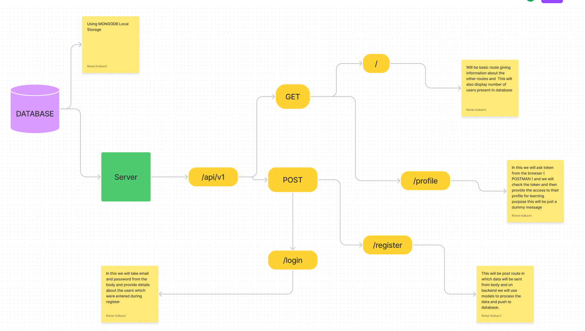

# Authentication API 

This Application provides basic authentication features like you can register and create account and then login and access your profile.

## REGISTER 

You can create a new account on `/register` route and you need to provide 
```
{
  "firstName":"Rohan",
  "lastName":"Kulkarni,
  "email":"rohank2502@gmail.com",
  "password":"xzy"
}
```

## LOGIN

You can Login into application using `/login` route you will be given a token which you can use to check profile. For login you need to provide `email` and `password` 
```
{
  "email":"rohank2502@gmail.com",
  "password":"xzy"
}
```

## PROFILE 

You can access your profile on `/profile` route. For this you need to provide token as `bearer` token and you will get details which you filled during register. 

## HOW TO SETUP ?
For setting up the project you need to download the project files and create a new file named `.env` in which you need to provide 3 variables as follow 
```
PORT=4001
MONGODB_URL=mongodb://127.0.0.1:27017/authenticationAPI
SECRET_KEY=yoursecretkey
```
After that you can use command `npm run dev` and try creating users.

